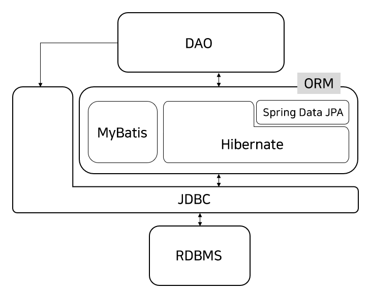

## 시작
이 글은 스프링과 관계형DB에 대해 일반적인 지식을 가지고 있지만 JPA는 생소한 사람들을 위해 작성되었습니다. 기초적인 내용을 가능하면 쉽게 정리하려고 합니다.

## ORM(Object Relational Mapping) 
먼저 ORM의 개념입니다. 추상적이고 식상한 설명이지만 이 개념을 계속 유지해야 JPA를 접근하는데 수월할 것 같습니다. 하이버네이트의 사용자 가이드에서는 아래와 같이 간단히 설명합니다.

>The term Object/Relational Mapping refers to the technique of mapping data from an object model representation to a relational data model representation (and vice versa).

객체와 관계형DB의 데이터를 매핑시켜서 객체지향 프로그램과 인터페이스할 수 있도록 하는 기술입니다. 즉 자바는 객체지향 언어이고 이에 맞게 관계형DB의 데이터를 객체지향적으로 처리하는 기술이라고 할 수 있습니다. 이미 알고 있는 것처럼 관계형DB의 데이터는 테이블이라는 형식으로 저장되어 있으므로 결국 테이블과 객체를 매핑하는 방법이라고 말할 수 있겠습니다. 테이블과 매핑되는 자바의 클래스를 "엔티티(Entity)"라고 합니다.

## JPA(Java Persistence API)
ORM은 자바만의 유일한 기술이 아닙니다. C#과 같은 객체지향 언어에도 "Entity Framework"라고 명명한 ORM 기술이 있습니다. 자바에서는 JPA라는 것을 제공합니다. 여기서 반드시 알아야 할 것은 JPA는 ORM을 구현한 어떤 라이브러리가 아니라는 점입니다. 말 그대로 이것은 API 스펙을 정해놓은 것이기 때문에 기업이나 오픈소스 진영에서 JPA 스펙에 맞게 구현한 다양한 이름의 구현체가 따로 있습니다.

참고로 MyBatis는 ORM 기술에 포함되기는 하지만 JPA 표준과는 무관하게 ORM 기술을 구현하기 때문에 JPA와는 구분합니다.

## 하이버네이트(Hibernate)
JPA 구현체 중 가장 널리 사용되는 것이 하이버네이트 라이브러러입니다. 사실 하이버네이트가 스프링의 JPA라고 해도 될 정도로 두 가지를 구별없이 사용하기 때문에 다소 혼란스러울 수 있습니다. 이것을 정리하려면 스프링 공식 문서를 [인용](https://docs.spring.io/spring-framework/docs/5.3.x/reference/html/data-access.html#orm-jpa-setup)할 필요가 있을 것 같습니다.

>The Spring JPA support offers three ways of setting up the JPA EntityManagerFactory that is used by the application to obtain an entity manager.

여기서 `EntityManagerFactory`라는 것은 어렵게 생각할 필요없이 바로 JPA 스펙이라고 생각하면 됩니다. 앞서 말한 것처럼 구현체는 다양하게 있으므로 어떤 구현체를 `EntityManagerFactory`로 사용할 것이냐에 따라 다를 것입니다. 스프링은 세 가지 옵션을 지원합니다.

- Using LocalEntityManagerFactoryBean

- Obtaining an EntityManagerFactory from JNDI

- Using LocalContainerEntityManagerFactoryBean  

처음 두 개는 잘 사용하지 않습니다. 대부분은 세번째 `LocalContainerEntityManagerFactoryBean`을 사용합니다. 당연히 `org.springframework.orm.jpa` 패키지에 있는 클래스입니다. 이 클래스를 스프링 빈으로 설정하는 방법은 나중에 코드를 보면서 설명하기로 하겠습니다.

그런데 세번째에 속하지만 JPA 표준 대신 구현체의 "native" API를 사용하는 방법도 소개되어 있습니다. 스프링에서는 구현체로 하이버네이트를 사용하므로 하이버네이트를 기준으로 아래와 같이 설명합니다.

>If you want to specifically configure a Hibernate setup, an immediate alternative is to set up a native Hibernate LocalSessionFactoryBean instead of a plain JPA LocalContainerEntityManagerFactoryBean, letting it interact with JPA access code as well as native Hibernate access code. See Native Hibernate setup for JPA interaction for details.

즉 하이버네이트의 네이티브 API도 함께 쓰려면 `LocalSessionFactoryBean`을 사용할 수도 있다는 말이 되겠습니다. 이 클래스는 `org.springframework.orm.hibernate5` 패키지에 포함되어 있습니다(참고로 스프링 프레임워크 5는 하이버네이트 5만을 지원합니다). 이것을 사용하면 `EntityManagerFactory` 대신에 하이버네이트의 `SessionFactory`를 사용할 수도 있게 됩니다.

이 글에서는 `LocalContainerEntityManagerFactoryBean`을 사용합니다.

## Spring Data JPA
그런데 여기서 "Spring Data JPA"라는 것이 또 등장합니다. 이것은 스프링에서 JPA를 보다 효율적이고 편하게 쓰기 위한 별도의 라이브러리입니다. 다시 혼란스러울 수 있는데 흔히 "스프링 JPA"라고 말하면 이것을 의미하는 경우가 많습니다. 하지만 이것을 쓰지 않고도 스프링에서 "plain JPA"만을 쓸 수 있습니다. 

이 글에서는 "스프링 데이터 JPA"를 <b>쓰지 않고</b> 순수(?) JPA를 쓰도록 하겠습니다. 이제까지 설명한 내용을 그림으로 요약하면 아래와 같습니다.

     

스프링에서 관계형DB와 데이터를 주고 받을 때, JDBC를 직접 쓸 수도, MyBatis를 쓸 수도, 하이버네이트를 쓸 수도, 또는 스프링 (데이터) JPA를 이용할 수도 있습니다.

[처음](../README.md) | [다음](../02/README.md)