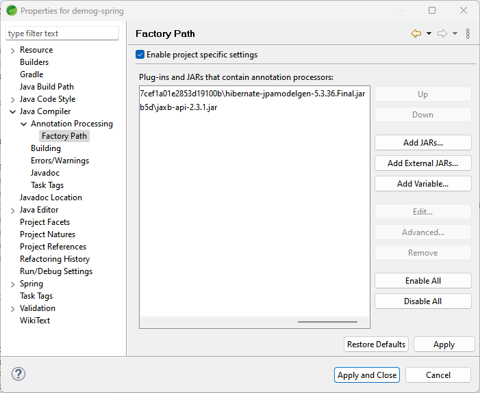

## Criteria API  

크라이테리아 API는 JPA 스펙에 다음과 같이 설명되어 있습니다.

>The Jakarta Persistence Criteria API is used to define queries through the construction of object-based query definition objects, rather than use of the string-based approach of the Jakarta Persistence query language...

이제까지 살펴본 쿼리는 크게 두 가지 종류로 구분될 수 있습니다. 

- 메소드명으로 자동 생성되는 쿼리 빌더
- JPQL, 네이티브 SQL

이제 여기에 다른 방식으로 쿼리를 작성하는 "Criteria API"가 추가되는 것입니다. 위의 설명에도 있는 것처럼 기존의 쿼리들은 대개 문자열로 작성되는, SQL과 유사한 형태의 static한 쿼리라고 할 수 있었습니다. 문자열 기반의 쿼리의 경우 동적으로 쿼리를 만들어내는 것은 한계가 있을 수 밖에 없습니다.

크라이테리어 API는 동적인 쿼리를 만들 때 활용할 수 있는 것으로, 이를테면 조회할 컬럼들은 동일하지만 조건절이 매번 달라지는 경우에 적용될 수 있습니다. 문자열로 SQL을 작성하는 것보다 객체지향적인 코드를 작성할 수 있고 컴파일 시점에 오류 여부를 즉시 알 수 있습니다(type-safe, less error-prone). 예를 들어 엔티티의 속성명이 바뀐 경우 JPQL의 쿼리는 직접 찾아서 문자열을 수정해야 하지만(또는 실행 시점에서 발견할 수 있지만) 크라이테리아 API로 작성된 경우 개발도구에서 수정할 부분을 바로 알 수 있습니다. 물론 단점도 있습니다. JPQL(또는 네이티브 SQL)은 어떤 쿼리인지 알아보기 쉬운 반면 크라이테리어 API로 작성된 쿼리는 다소 장황하고(verbose) 한 눈에 잘 들어오지 않는 측면이 있습니다.  

크라이테리아 API를 사용하려면 정적 메타모델(static metamodel) 클래스를 만들어야 합니다. 컴파일 과정에서 "annotation processor"가 정해진 규칙에 의해서 각 엔티티에 대응되는 메타모델 클래스를 자동생성합니다. 예를 들어 `Singer`는 `Singer_`라는 이름의 메타모델 클래스가 동일한 패키지 안에 만들어집니다.  

메타모델 클래스를 생성하려면 아래와 같은 디펜던시가 필요합니다(메이븐과 크레이들 설정 파일에 추가)
```
dependencies {

    annotationProcessor "org.hibernate:hibernate-jpamodelgen:$hibernateVersion"    
}
```
```
<dependency>
    <groupId>org.hibernate</groupId>
    <artifactId>hibernate-jpamodelgen</artifactId>
    <version>${hibernate.version}</version>
</dependency>
```
JDK 6 이상에서는 디펜던시에 추가하는 것만으로도 자동 실행이 됩니다.  

이와는 별도록 개발 도구에서 메타모델을 생성하기 위해서는, STS 4 기준으로, 해당 프로젝트의 Properties > Java Compiler > Annotation Processing 을 설정해야 합니다. 




메타모델 클래스가 생성되었으면 이제 이것을 이용하여 Criteria API를 사용할 수 있습니다. 예를 들어 출생일을 조건으로 Singer를 조회하는 쿼리를 작성하도록 하겠습니다.

```
public List<Singer> fetchSingerByBirthDate(Date birthDate) {
		
      CriteriaBuilder cb = em.getCriteriaBuilder();
      CriteriaQuery<Singer> cq = cb.createQuery(Singer.class);		
      Root<Singer> root = cq.from(Singer.class);		
		
      // restrictions
      cq.where(cb.greaterThan(root.get(Singer_.birthDate), birthDate));	

      return em.createQuery(cq).getResultList();
}
```


[처음](../README.md)